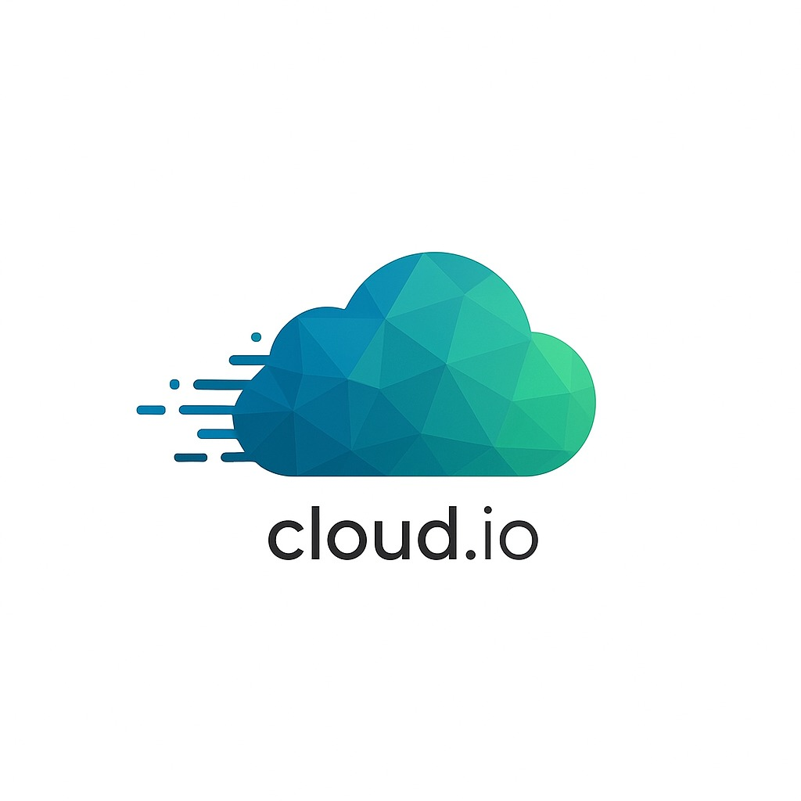
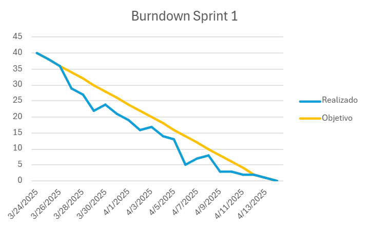
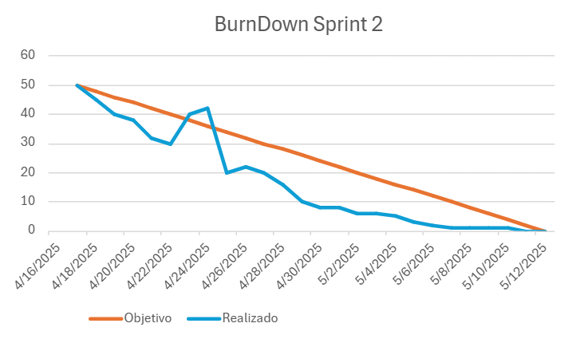

# 🚀 Cloud.IO

<h1>DESCRIÇÃO:</h1>    
Cloud.io é um software meteorológico com o objetivo de manter as pessoas informadas sobre condições climáticas extremas. A principal função é o monitoramento do clima e a emissão de alertas para a população sobre fortes ventos na região, garantindo mais segurança e antecedência para evitar situações de risco.

# 🗂️ SPRINTS
| Sprint | Data de Início | Data de Entrega | Status  |
|--------|----------------|-----------------|---------|
|  1     | :calendar: ➡ (24/03/2025) | 📆 ➡ (14/04/2025) |  Encerrado |
|  2     | :calendar: ➡ (16/04/2025) | 📆 ➡ (12/05/2025) |  Encerrado |
|  3     | :calendar: ➡ (14/05/2025) | 📆 ➡ (16/06/2025) |  Em Andamento |

---

# 🏁 Detalhamento das Sprints

## 🚀 Sprint 1 (24/03/2025 - 14/04/2025)
### O que foi feito:
- Criação da prototipagem da aplicação utilizando o Figma.
- Implementação da arquitetura inicial do projeto.
- Criação do esqueleto da interface (front-end) utilizando React.
- Configuração do banco de dados MongoDB e integração inicial com a API.
- Implementação do cadastro de usuários e autenticação básica através da página de login.
- Melhoria na interface com a criação da homepage e adição de gráficos interativos para a visualização dos dados climáticos.

### Problemas encontrados durante a Sprint 1:
- Nenhuma dificuldade significativa encontrada.

### Tecnologias usadas:
- React, Styled Components, Node.js, MongoDB, Figma para design.

---

## 🚀 Sprint 2 (16/04/2025 - 12/05/2025)
### O que foi feito:
- Implementação do sistema de alertas para condições climáticas extremas.
- Criação de uma página com explicação do projeto e documentação inicial.
- Criação de mapas meteorológicos e simulação da localização das usinas.
- Criação de um histórico meteorológico e possibilidade download de dados.
- Criação de páginas pré-visualizadoras para usuários não cadastrados.
- Reformulação e padronização do design do site.

### Problemas encontrados durante a Sprint 2:
- Não conseguimos realizar a conexão do banco de dados do cliente com a nossa aplicação, sendo esse requisito remanejado para a Sprint 3
- Não fizemos a emplementação de APIs externas para busca de dados meteorológicos em tempo real.

### Tecnologias usadas:
- React, Node.js, MongoDB, Chart.js para gráficos, Leaflet para os mapas.

---

# BURNDOWN SP1
 

 
 

-----------------------------------------------------------------------------------

# BURNDOWN SP2
 

 
 

-----------------------------------------------------------------------------------

# BURNDOWN SP3
 

 
 

-----------------------------------------------------------------------------------

# 🔗 LINKS

### 🧮 TRELLO 
[Clique Aqui](https://trello.com/c/vt5ONAZV/8-github-do-projeto)

### 📖 REQUISITOS DO CLIENTE
[Clique Aqui]()

### 🎨 FIGMA
[Clique Aqui](https://www.figma.com/design/atcc0stddRRA7XQv3WkyAN/Cloud.io-proj?node-id=0-1&t=KqRqIEVgevh3atoq-1)

# :computer: EQUIPE

|CARGO | NOME| SOCIAL MEDIA |
|------|-----|:--------------:|
| P.O (Product Owner) |   André Ventura   |     |    
| Scrum Master |   Bruno Henrique   |     |  
| Dev     |   Eduardo Henrique  |     |  
| Dev     |   Valcir  |     |   
| Dev     |   Andre Michel   |     |  
| Dev     |   Rodrigo   |     |  
